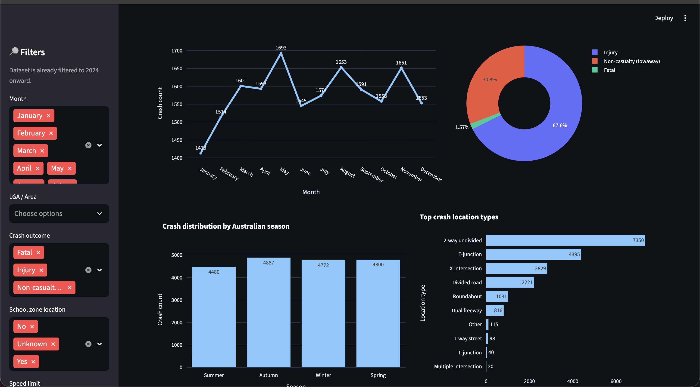
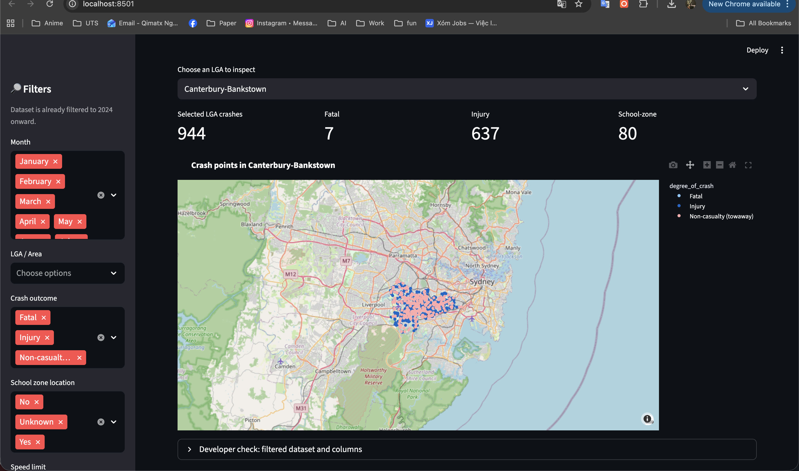
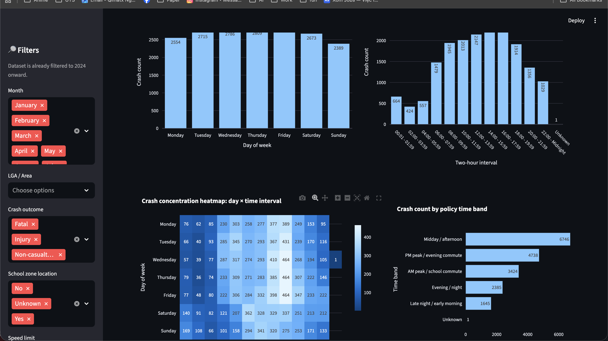
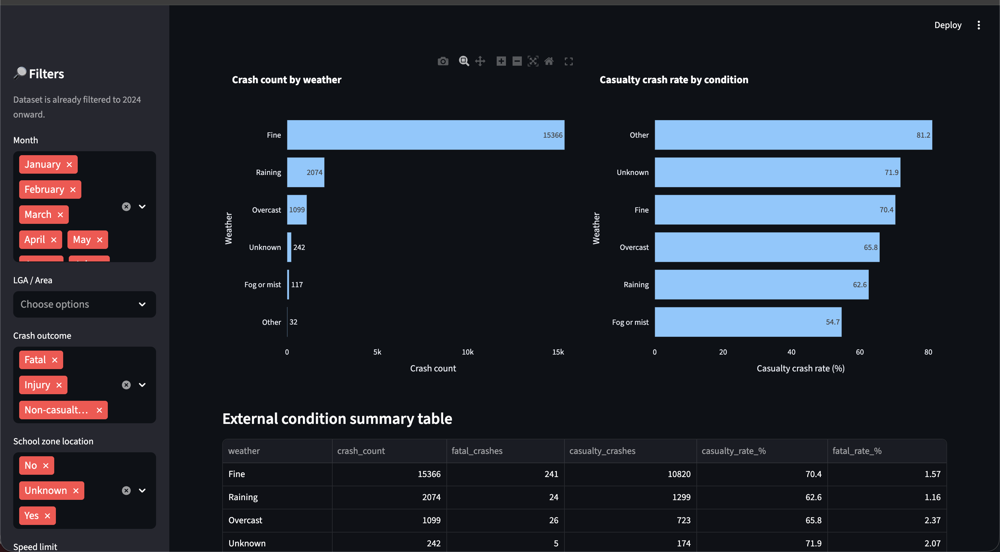
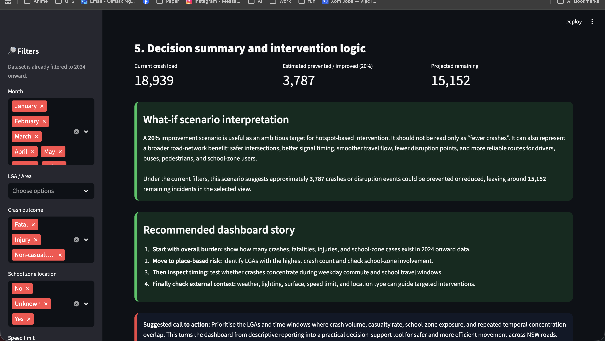

# NSW Road Crash Risk Intelligence Dashboard  
### 36104 – Data Visualisation and Narratives (DVN) Assignment 3  
### Group 22

---

# Project Overview

This project was developed as part of the **Data Visualisation and Narratives Studio Assignment** at the University of Technology Sydney (UTS). The objective of the assignment is to transform real-world crash data into an interactive and persuasive narrative dashboard that supports evidence-based road safety decision-making.

Our project focuses on analysing **NSW Road Crash Data from 2024 onward** to investigate crash hotspots, identify temporal and spatial risk patterns, examine school-zone exposure, and support targeted road safety interventions.

The dashboard is designed for the stakeholder persona:

> **Transport for NSW / NSW Road Safety and Network Operations Stakeholders**

The system uses a policy-focused investigative narrative where users progressively uncover:

- the overall crash burden,
- which LGAs show the highest crash concentration,
- when crashes occur most frequently,
- which external conditions appear in crash contexts,
- and which areas should be prioritised for intervention.

---

# Narrative Objective

This dashboard is not designed as a passive reporting tool. Instead, it functions as a decision-support narrative system intended to:

- reveal crash patterns from recent NSW data,
- communicate urgency through visual storytelling,
- support hotspot-based policy prioritisation,
- identify high-risk time periods,
- and encourage targeted road safety action.

The dashboard narrative is organised into **five main tabs**:

1. Overall Crash Overview  
2. Hotspots + School Zones  
3. Day and Time Risk  
4. External Conditions  
5. Decision Summary  

---

# Dataset

## Dataset Source

NSW Government Open Data Portal

## Dataset Used

**NSW Road Crash Data**

## Dataset Link

https://data.nsw.gov.au/data/dataset/2-nsw-crash-data

## Data Used in This Dashboard

The dashboard uses the cleaned dataset:

```text
data/nsw_crash_data_clean.csv
```

The project filters the data to keep:

```python
year_of_crash >= 2024
```

This means:

- 2024 is included
- 2023 and earlier records are removed
- future years are kept if available

A filtered output file can also be created by running `data_check.py`:

```text
data/nsw_crash_data_2024_onward.csv
```

## Key Dataset Characteristics

- Real-world government dataset
- Recent and policy-relevant
- Includes temporal crash variables
- Includes spatial crash variables
- Includes LGA and location details
- Includes crash severity outcomes
- Includes school-zone indicators
- Includes environmental and road condition variables
- Suitable for interactive dashboard and narrative analysis

---

# Dashboard Features

## Core Features

- Interactive filtering by:
  - month
  - region / LGA
  - crash outcome
  - school-zone location
  - speed limit

- Overall crash summary metrics
- Monthly crash trend analysis
- Seasonal crash pattern analysis
- Hotspot LGA ranking
- School-zone crash analysis
- Day and time risk analysis
- Peak commute / school travel window check
- External condition comparison
- Interactive hotspot map
- What-if intervention scenario
- Policy recommendation framework

---

# Advanced Features Implemented

## 1. Context-Aware Filtering

Sidebar filters dynamically update all charts, KPI cards, tables, and narrative summaries.

## 2. Modular Tab-Based Narrative Structure

The dashboard is separated into five tabs, allowing the user to move from general crash overview to specific intervention logic.

## 3. Hotspot Investigation

The hotspot tab identifies LGAs with the highest crash burden and supports localised investigation using school-zone indicators and spatial mapping.

## 4. Temporal Risk Analysis

The time-risk tab examines weekday patterns, two-hour intervals, and commute/school travel windows to identify when crashes are most concentrated.

## 5. What-if Parameterisation

A simulation slider estimates potential crash reduction and broader traffic improvement under a hypothetical intervention scenario.

The default scenario is:

```text
20% estimated prevented / improved
```

This is treated as an ambitious intervention target, not a guaranteed prediction.

---

# Technologies Used

| Technology | Purpose |
|---|---|
| Python | Core development |
| Streamlit | Interactive dashboard framework |
| Pandas | Data processing and cleaning |
| Plotly | Interactive visualisation |
| OpenPyXL | Excel support if required |
| GitHub | Collaboration and version control |

---

# Repository Structure

```text
36104_DVN_AT3_25670050/
│
├── app.py
├── utils.py
├── data_check.py
├── requirements.txt
├── readme.MD
│
├── data/
│   └── nsw_crash_data_clean.csv
│
├── screenshots/
│   ├── tab1.png
│   ├── tab2.png
│   ├── tab3.png
│   ├── tab4.png
│   └── tab5.png
│
└── tabs/
    ├── __init__.py
    ├── overview.py
    ├── hotspots.py
    ├── time_risk.py
    ├── external_conditions.py
    └── decision_summary.py
```

---

# Running the Dashboard Locally

## Step 1 — Open Project Folder

```bash
cd 36104_DVN_AT3_25670050
```

## Step 2 — Create a Virtual Environment

### macOS / Linux

```bash
python3 -m venv .venv
source .venv/bin/activate
```

### Windows

```bash
python -m venv .venv
.venv\Scripts\activate
```

## Step 3 — Install Requirements

```bash
pip install -r requirements.txt
```

## Step 4 — Run Data Check

```bash
python3 data_check.py
```

This checks the dataset, filters the data to 2024 onward, and saves:

```text
data/nsw_crash_data_2024_onward.csv
```

## Step 5 — Run Streamlit Dashboard

```bash
streamlit run app.py
```

Then open the local URL shown in the terminal, usually:

```text
http://localhost:8501
```

---

# Dashboard Tabs and Screenshots

The dashboard contains five tabs. The screenshots below follow the same order as the dashboard navigation.

---

## 1. Overall Crash Overview

This tab introduces the crash dataset and gives a high-level view of the selected data.

It includes:

- total crashes
- fatal crashes
- injury crashes
- LGAs analysed
- school-zone crashes
- monthly crash trend
- crash outcome composition
- seasonal crash pattern
- crash location type summary



---

## 2. Hotspots + School Zones

This tab identifies the highest-risk LGAs and checks whether crashes are connected to school-zone locations.

It includes:

- top hotspot LGAs by crash count
- hotspot statistics table
- fatal crash count
- injury crash count
- casualty rate
- school-zone crash count
- active school-zone crash count
- selected LGA crash map

This tab supports place-based intervention planning.



---

## 3. Day and Time Risk

This tab examines when crashes occur most frequently.

It includes:

- crash count by weekday
- crash count by two-hour interval
- day × time heatmap
- commute and school travel peak-hour check

The broad peak travel windows used are:

```text
06:00 – 09:59
16:00 – 19:59
```

This helps test whether crash risk overlaps with busy Australian travel periods.



---

## 4. External Conditions

This tab examines crash context based on external factors.

It includes analysis of:

- weather
- natural lighting
- surface condition
- road surface
- street lighting
- speed limit
- type of location

Important note: these charts show conditions recorded during crashes. They do not prove causation because the dataset does not include exposure data such as total traffic volume, weather duration, or road usage by condition.



---

## 5. Decision Summary

This tab transforms the dashboard from reporting into decision support.

It includes:

- current crash load
- estimated prevented / improved scenario
- projected remaining crashes
- intervention interpretation
- recommended dashboard story
- suggested call to action

The default scenario is:

```text
Estimated prevented / improved (20%)
```

This does not only mean reducing crashes. It also represents broader road-network benefits such as:

- safer intersections
- better signal timing
- smoother travel flow
- fewer disruption points
- more reliable routes for drivers, buses, pedestrians, and school-zone users



---

# Design Principles Applied

The dashboard incorporates principles from:

- Gestalt visual organisation
- visual hierarchy
- pre-attentive attributes
- cognitive load reduction
- stakeholder-centred storytelling
- progressive disclosure through tab-based navigation

The dark executive-style interface was selected to resemble modern intelligence, monitoring, and risk-management systems used in professional environments.

---

# Intended Stakeholder Impact

The dashboard aims to help NSW transport and road safety stakeholders:

- identify high-risk LGAs
- prioritise infrastructure reviews
- detect school-zone exposure
- understand crash timing patterns
- support targeted enforcement planning
- examine environmental and road condition contexts
- improve evidence-based road safety intervention strategies
- optimise road movement and reduce crash-related disruption

---

# Key Message

The main message of this dashboard is:

> Road safety action should not be spread evenly everywhere. It should be targeted where repeated evidence shows high crash volume, severe outcomes, school-zone exposure, and clear time or location concentration.

---

# Call to Action

The dashboard recommends prioritising areas where the following risks overlap:

1. High crash volume
2. Fatal or injury crash concentration
3. School-zone exposure
4. Repeated weekday or peak-hour concentration
5. External risk conditions such as poor lighting, wet surface, high-speed roads, or complex location types

This helps turn the dashboard from descriptive reporting into a practical decision-support tool for safer and more efficient movement across NSW roads.

---

# Contribution

## Contributor

**Group 22**

## Contribution Areas

- Narrative architecture
- Streamlit dashboard development
- Data preprocessing
- Modular tab-based application structure
- Interactive filtering system
- Visual storytelling implementation
- Hotspot and temporal crash analysis
- Policy recommendation framework
- README and documentation

---

# Academic Context

This project was developed for:

**36104 – Data Visualisation and Narratives**  
University of Technology Sydney (UTS)

---

# Disclaimer

This dashboard is developed for academic and educational purposes only. The analyses and recommendations presented are exploratory and should not be interpreted as official NSW Government policy advice.
